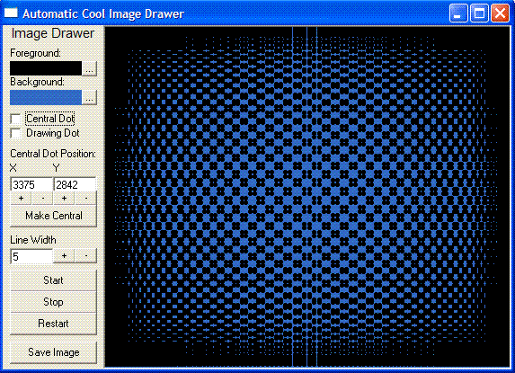



## Automatic Cool Image Drawer Thing

### Description

This was originally going to be a particle sim but it turned out to be able to draw awesome pictures on its own!
 
### More Info
 
You can change all sorts of options from the bar on the left

A cool pattern kind of thing that you can save as a .bmp image

             |
---                |---
**Submitted On**   |2005-04-14 00:55:02
**By**             |[stegasaurus](https://github.com/Planet-Source-Code/PSCIndex/blob/master/ByAuthor/stegasaurus.md)
**Level**          |Intermediate
**User Rating**    |3.7 (11 globes from 3 users)
**Compatibility**  |VB 6\.0
**Category**       |[Graphics](https://github.com/Planet-Source-Code/PSCIndex/blob/master/ByCategory/graphics__1-46.md)
**World**          |[Visual Basic](https://github.com/Planet-Source-Code/PSCIndex/blob/master/ByWorld/visual-basic.md)
**Archive File**   |[Automatic\_1876484142005\.zip](https://github.com/Planet-Source-Code/stegasaurus-automatic-cool-image-drawer-thing__1-59998/archive/master.zip)

